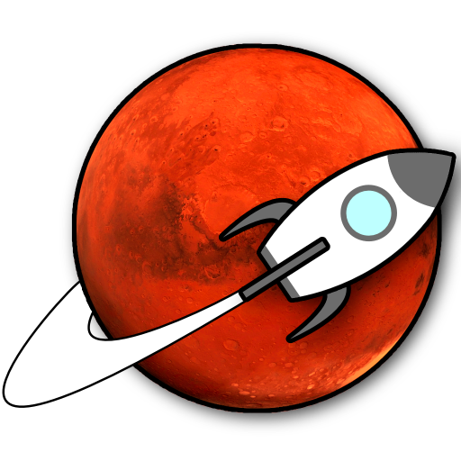

<h1 align="center">
  &nbsp;<span style="font-size:80px;">Rover Steering</span>
</h1>

<h3 align="center">
  ReactJS application for rover control.
</h3>

<p align="center">The best way to control your rover!</p>

<p align="center">

  

  <a href="https://www.linkedin.com/in/daniel-santos-040983ab/" target="_blank" rel="noopener noreferrer">
    
  </a>

  

  <a href="https://github.com/dvargas42/space-traveling/commits/main">
    
  </a>

  <a href="https://github.com/dvargas42/space-traveling/issues">
    
  </a>

  
</p>


<p align="center">
  <a href="#%EF%B8%8F-about-the-project">About the project</a>&nbsp;&nbsp;&nbsp;|&nbsp;&nbsp;&nbsp;
  <a href="#-screnshots">Screenshots</a>&nbsp;&nbsp;&nbsp;|&nbsp;&nbsp;&nbsp;
  <a href="#-technologies">Technologies</a>&nbsp;&nbsp;&nbsp;|&nbsp;&nbsp;&nbsp;
  <a href="#-getting-started">Getting started</a>&nbsp;&nbsp;&nbsp;|&nbsp;&nbsp;&nbsp;
  <a href="#-how-to-contribute">How to contribute</a>&nbsp;&nbsp;&nbsp;|&nbsp;&nbsp;&nbsp;
  <a href="#-license">License</a>
</p>

## 💇🏼 About the project

This app was part of a composite challenge to challenge the ability to develop an algorithm that would receive an instruction from the LRM to move a mars rover over a plateau.

## 📸 Sreenshots

Images of the application in operation.

<p align="center">

</p>

<p align="center">

</p>

## 🚀 Technologies

Technologies that I used to develop this api


- [React](https://reactjs.org/)
- [Node.js](https://nodejs.org/en/)
- [TypeScript](https://www.typescriptlang.org/)
- [Sass](https://sass-lang.com/)
- [React Modal](http://reactcommunity.org/react-modal/)
- [React Toastify](https://fkhadra.github.io/react-toastify/introduction/)


## 💻 Getting started

### Requirements

- [Node.js](https://nodejs.org/en/)
- [Yarn](https://classic.yarnpkg.com/) or [npm](https://www.npmjs.com/)


### Clone the project and access the folder

```bash
$ git clone https://github.com/dvargas42/rover-steering.git
```

### Follow the steps below**

Install the dependencies
```bash
$ yarn
```
To finish, run the webapp 
```bash
$ yarn dev
```

Well done, project is started!

## 🤔 How to contribute

**Make a fork of this repository**

```bash
# Fork using GitHub official command line
# If you don't have the GitHub CLI, use the web site to do that.

$ gh repo fork dvargas42/rover-steering
```

**Follow the steps below**

```bash
# Clone your fork
$ git clone your-fork-url && cd rover-steering
# Create a branch with your feature
$ git checkout -b my-feature

# Make the commit with your changes
$ git commit -m "My new feature"

# Send the code to your remote branch
$ git push origin my-feature
```

After your pull request is merged, you can delete your branch

## 📝 License

This project is licensed under the MIT License - see the [LICENSE](LICENSE) file for details.

---

Made with 💜 &nbsp;by Daniel Vargas 👋 &nbsp;[See my linkedin](https://www.linkedin.com/in/daniel-santos-040983ab/)